# Speed/accuracy analysis of object detection models in an embedded system

## Authors 
**Rekib Zaman, Manu Mathew, Parakh Agarwal**  
*Processors, Embedded Processing, Texas Instruments*

## Introduction
Low power embedded systems are highly optimized in terms of memory and compute capabilities. Running Deep Neural Network (DNN) models efficiently on these systems is a challenge that needs expertise and tuning for the specific scenario. We propose modifications to popular object detection models that can help them run faster and more accurately on embedded systems. 

### Model surgery as an effective approach to improve model support
DNNs are increasing in complexity and the variety of layer types being used with each passing year. Those who are trying to run their favourite models on a certain embedded system may find that their preferred layer type may not run be running at the expected speed on that particular system. The user then has to request to the Software vendor to improve the support for that layer type - and it may take some time for that support to arrive. And this is not always mechanism for all users. 

An alternative is to replace the un-optimal layers with equivalent or similar layers.  The replacement should be such that it doesn't bring in significant degradation in accuracy after the user finetunes or retrains the model. We call this operation as Model Surgery to create "Lite" models. 

In this study, we provide several such Model Surgery examples - layers that can be replaced in the place of other more complex layers. Several example models were such surgery can be applied are shown. We train the models after the modifications and accuracies are compared before after the Model Surgery & re-training to show that the degradation in accuracy is small.

### Accuracy considerations
Object detection models are hard to quantize, since they contain regression output (such as the bounding box prediction) especially with  8bits quantization. Here, we also study the impact of quantization and provides effective solutions to improve the accuracy with quantization. 

Object detection models also require several parameters such as top_k, detection_threshold etc. to be tuned carefully to achieve the best speed/accuracy tradeoff. We show the tradeoffs involved in the tuning process. Finally, suggestions are provided on parameters suited for various scenarios such as accuracy measurement or embedded inference. 

### Methodology

The analysis is done using several recent and popular variants of [YOLO](https://github.com/TexasInstruments/edgeai-tensorlab/tree/main/edgeai-modelzoo/models/vision/detection) and also the popular [SSD: Single Shot Multi-Box Detctor](https://arxiv.org/abs/1512.02325). [COCO](https://cocodataset.org/) object detection dataset is used for training, validation and to report accuracy. [edgeai-tidl-tools](https://github.com/TexasInstruments/edgeai-tidl-tools) and [edgeai-benchmark](../../../edgeai-benchmark) is used to compile and benchmark to models for inference in [AM68A](https://www.ti.com/product/AM68A) SoC from Texas Instruments.

All inference times are in milliseconds, as indicated by the abbreviation (ms). The accuracy metric used is as defined by the COCO dataset, called AP[.5:.95] in percentage, or often denoted as AP. 

### Models being analyzed
 These are the models being analyzed in this study. The exact configurations used for these experiments are in the configs folder of [edgeai-benchmark](https://github.com/TexasInstruments/edgeai-tensorlab/tree/main/edgeai-benchmark).

| **model id** | **model name**      |
|--------------|---------------------|
| od-8020      | ssd_mobilenetv2     |
| od-2060      | ssdlite_mobilenetv2 |
| od-8040      | ssd_regnetx_200mf   |
| od-8880      | yolov8\_small       |
| od-8850      | yolov7\_tiny        |
| od-8860      | yolov7\_large       |
| od-8890      | yolox\_tiny         |
| od-8900      | yolox\_small        |
| od-8800      | yolov4\_csp         |
| od-8820      | yolov5\_small       |
|              |                     |

## **Typical changes induced in Model Surgery to create in Lite models**

### **SiLU, LeakyReLU, Mish to ReLU**

The activation functions like SiLU, LeakyReLU, Mish are not supported in TIDL so we replace it ReLU activation function in the lite model

|     |     |
| --- | --- |
| SiLU, LeakyReLU, Mish                         | ReLU                           |
| 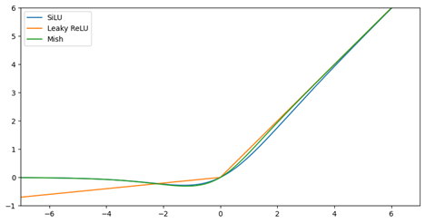 |  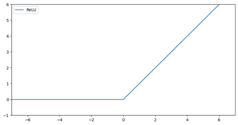  |
| | |

### **MaxPool 5x5,9x9,13x13 to MaxPool 3x3**

MaxPool layers with kernel size 5x5, 9x9, 13x13 are not supported in TIDL so they are replaced with MaxPool of kernel size 3x3 . Two consecutive MaxPool layer of kernel size 3x3 gives same output as one Maxpool layer of kernel size 5x5. So 1 maxpool of size 5x5 is replaced with 2 maxpool of size 3x3. Similarly maxpool of size 9x9 and 13x3 is replaced with 4 maxpool layer of size 3x3 and 6 maxpool layer of size 3x3 respectively. But point to be noted is that, as it does not involve ant weights , this change does not affect in accuracy.

|     |     |
| --- | --- |
| MaxPool 5x5,9x9,13x13                         | MaxPool 3x3                        |
| 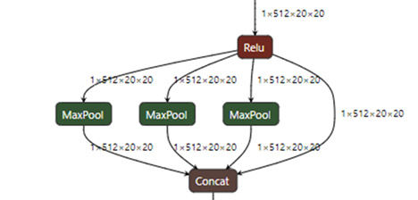 |  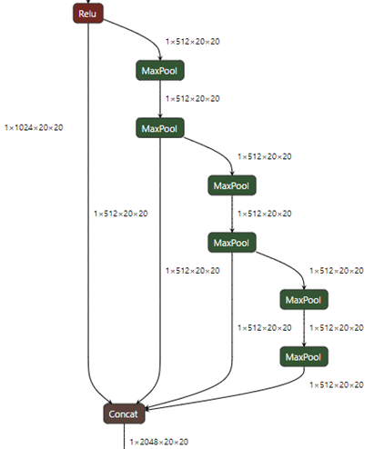 |
| | |

### **Focus Layer to Convolution layer**

Focus was a layer type that was made popular by [yolov5](https://github.com/ultralytics/yolov5). See a [picture](https://www.researchgate.net/figure/YOLOv5s-focus-layer-improvement_fig2_371000363) to understand the structure of the layer. The input signal has typically high spatial dimensions and low number of channels - this may not be optimal for the subsequent Convolution operation (Convolution operations are typically optimized to process high number of channels). The idea of Focus layer is to quickly reduce the spatial dimensions at the input and increase the number of channels at the same time without loss of information.

As the Focus layer is used only in certain class of models, and since it involves data movement, it may not be fully optimal for embedded inference. Focus layer reduced the input size to half, we can perform this using a conv layer with hardware accelerated Convolution operation. Also, it is possible to fix the weights of the newly introduced conv layer so that the operation matches exactly with the Focus layer - this is especially useful if we want to accelerate the learning by just finetuning from the original model.

|     |     |
| --- | --- |
| Focus Layer                        | replaced Conv                      |
| 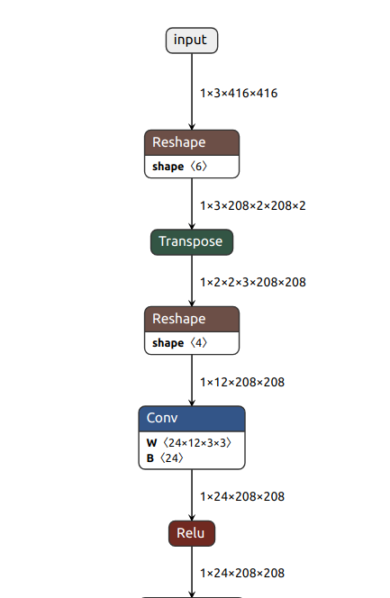  |  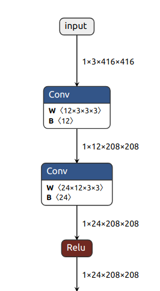 |
| | |

### **Conv 6x6 to Conv 5x5**

Convolution layer of kernel size 6x6 in yolov5 has been replaced with convolution layer of kernel size 5x5, as TIDL does not support 6x6 conv layer as of now.

## List of changes in each models

|     |     |     |
| --- | --- | --- |
| **Model names** | **original models** | **lite models** |
| yolov8\_small | SilU  MaxPool 5x5 | ReLU  2 MaxPool 3x3 |
| yolov4\_csp | Mish  MaxPool 5x5  MaxPool 9x9  MaxPool 13x13 | ReLU  2 MaxPool 3x3  4 MaxPool 3x3  6 MaxPool 3x3 |
| yolov5\_small| Conv 6x6  SiLU  MaxPool 5x5 | Conv 5x5  ReLU  2 MaxPool 3x3 |
| yolov7\_tiny ,  yolov7\_large | LeakyReLU  MaxPool 5x5 | ReLU  2 MaxPool 3x3 |
| yolox\_tiny ,   yolox\_small | SiLU  Focus Layer  MaxPool 5x5  MaxPool 9x9  MaxPool 13x13 | ReLU  Conv Layer 5x5  2 MaxPool 3x3  4 MaxPool 3x3  6 MaxPool 3x3 |

## Accuracy impact of Model surgery

The layers that are not supported in TIDL are replaced with similar layers that are supported in TIDL. This makes the model embedded friendly but with a small loss in accuracy. Here is a comparison of few models which show how much accuracy drops we get in this process. This accuracy is obtained from running test on COCO dataset in PC. The models that are compared here are yolov8-small, yolov7-large, yolov5-small, yolov4-csp, yolox-tiny, yolov7-tiny and yolovx\_small. 

Among these models, in the yolov5-small we see a drop in accuracy from 37.7 AP to 35.5 AP, i.e. 2.2 AP drop in lite version. In Yolov7\_tiny we see a drop from 37.5 AP to 36.6 AP, i.e a drop of 0.8  AP. Looking at all these results, we can generalize and say that typically the drop is about 1 to 3 AP points in lite models.

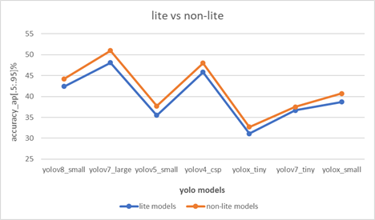

|     |     |     |
| --- | --- | --- |
| models\_name | non-lite-model-acc | lite-model-acc |
| yolov8\_small | 44.2 | 42.4 |
| yolov7\_large | 51  | 48.1 |
| yolov5\_small | 37.7 | 35.5 |
| yolov4\_csp | 48  | 45.8 |
| yolox\_tiny | 32.7 | 31.1 |
| yolov7\_tiny | 37.5 | 36.7 |
| yolox\_small | 40.7 | 38.7 |
|   |   |

## **Effect of mixed-precision**

We see a drop in accuracy when we run the full model in 8bit mode. We see up to 7% AP drop in some models when ran on pure 8bit mode, But the drop was recovered when we run the models in mixed-precision mode. In mixed-precision we basically run the end layers of the neck module in 16bit mode, which helps to recover the drop in 8bit.

|     |     |     |     |     |     |     |
| --- | --- | --- | --- | --- | --- | --- |
| models\_name | non-lite-model-acc | lite-model-acc | 32bit-acc | 8bit-acc | 8bit-acc-mp | GMACs |
| yolov8\_small | 44.2 | 42.4 | 41.44 | 39.881021 | 40.702836 | 14.3337 |
| yolov7\_large | 51  | 48.1 | 46.93 | 42.242723 | 46.63116 | 52.9457 |
| yolov5\_small | 37.7 | 35.5 | 34.83 | 31.953114 | 34.108788 | 8.1323 |
| yolov4\_csp | 48  | 45.8 | 45.3 | 42.443044 | 45.135142 | 60.1735 |
| yolox\_tiny | 32.7 | 31.1 | 30.56 | 23.157898 | 30.445955 | 3.2534 |
| yolov7\_tiny | 37.5 | 36.7 | 35.75 | 32.146389 | 35.50527 | 6.8741 |
| yolox\_small | 40.7 | 38.7 | 38.11 | 32.346607 | 37.921559 | 13.4596 |
|     |     |     |     |     |     |     |

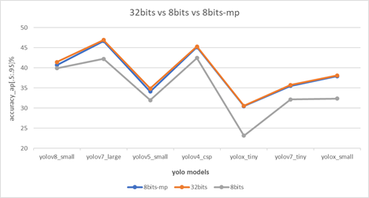

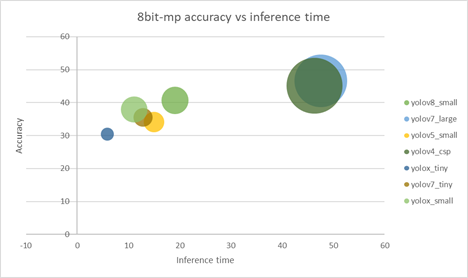

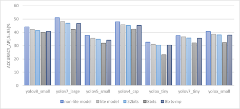

## **Performance on TIDL**

In this section we compare the performance of the models running in TIDL on the [AM68A](https://www.ti.com/product/AM68A) SoC. For this experiment we use four YOLO models, yolov7-large, yolov5-small, yolov4-csp and yolov7-tiny . We first run the whole model without TIDL i.e, fully in ARM mode. Then we run only the backbone(backbone+neck) part in TIDL and the head part in ARM mode. Then we finally run the full model in TIDL. We also run the models one more time in TIDL by adjusting the detection threshold to get better accuracy. We initially used detection threshold of 0.25 and topK of 100, then we reduced the detection threshold to 0.05 and increased the topK to 500. This table shows the accuracy as well as inference time :

|                          |     |     |     |     |     |     |
|--------------------------| --- | --- | --- | --- | --- | --- |
|                          |     | yolov7\_large | yolov5\_small | yolov4\_csp | yolov7\_tiny |
| **Accuracy AP\[.5:.95\]%** | **without\_tidl** | 42.126174 | 30.196424 | 40.028126 | 30.724629 |
| **Accuracy AP\[.5:.95\]%** | **backbone\_tidl** | 41.588899 | 29.270204 | 38.1228 | 29.842514 |
| **Accuracy AP\[.5:.95\]%** | **tidl\_25\_100** | 42.211561 | 29.768259 | 40.065406 | 30.702776 |
| **Accuracy AP\[.5:.95\]%** | **tidl\_05\_500** | 45.711503 | 33.412331 | 44.316673 | 34.626288 |
|                          |     |     |     |     |     |     |
| **Inference Time (ms)**  | **without\_tidl** | 6671.132608 | 1088.245636 | 7560.71492 | 956.867193 |
| **Inference Time (ms)**       | **backbone\_tidl** | 101.190856 | 65.981589 | 115.274344 | 65.550423 |
| **Inference Time (ms)**       | **tidl\_25\_100** | 46.604622 | 13.175834 | 44.581183 | 11.941207 |
| **Inference Time (ms)**       | **tidl\_05\_500** | 46.921291 | 13.77424 | 45.188118 | 12.216323 |
|                          |     |     |     |     |     |     |

## Effect on Inference time

We see very high inference time when running the model on ARM mode. The large models like yolov7-large and yolov4 takes around 7 seconds for a single frame. When we run the backbone in TIDL we see drastic change in inference time. Yolov7-large which took 6671ms for 1 frame in ARM mode tool only 101ms by running the backbone in TIDL.

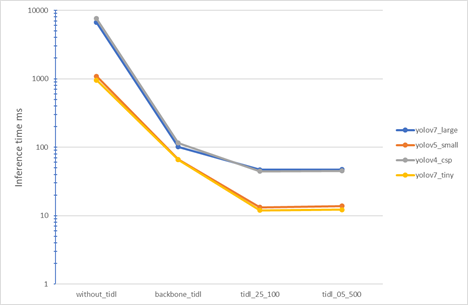

Now, when we run the full model in TIDL we see further improvement in inference time. The inference time for yolov7-large further reduced from 101ms to 46ms. The below table shows the fps for the models on running on TIDL

|     |     |     |     |     |
| --- | --- | --- | --- | --- |
|     | yolov7\_large | yolov5\_small | yolov4\_csp | yolov7\_tiny |
| fps | 21.45709926 | 75.89652389 | 22.4309884 | 83.74362826 |
|     |     |     |     |     |

When we further adjust the detection threshold for better accuracy we see negligible change in inference time. So we can use the most suitable detection threshold for each model to get maximum accuracy with minimum change in inference time. We will discuss threshold adjustment in further section.

## Effect on Accuracy

As expected we don’t see much change in accuracy when we run model in ARM mode or in TIDL. We see improvement in accuracy when we adjust the detection threshold also without any change in inference time as we have seen in previous section.

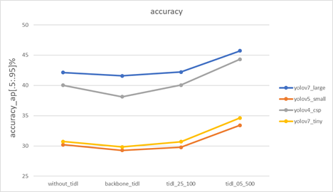

## **Tuning detection threshold for better accuracy**

As we saw in the previous section that reducing the detection threshold can improve the accuracy, but if we reduce the threshold by huge amount the accuracy might get better but it will worsen the performance. So what is the right detection threshold to get better accuracy with minimum change in the inference time. We perform an experiment to get the idea about which detection threshold and topK works better for which detection models. In this experiment we use 5 YOLO and 3 SSD od-models. We use 3 different set of confidence threshold of 0.3, 0.05 and 0.01 in combination with three different topK of 200, 500 and 1000 to check how the accuracy metric and inference time varies while tuning those values, also to notice the trade-off between accuracy and inference time.

|     |     |     |     |     |     |     |
| --- | --- | --- | --- | --- | --- | --- |
|     | yolov7\_tiny |     |     | ssd\_regnetx\_200mf\_320 |     |     |
|     | Inference Time (ms) | 8bits Accuracy | float Accuracy | Inference Time (ms) | 8bits Accuracy | float Accuracy |
| ConfidenceTh=0.3 Topk=200 | 11.92091 | 29.82639 | 30.538 | 6.10956 | 15.602666 | 17.33 |
| ConfidenceTh=0.05 Topk=200 | 12.074695 | 34.645118 |     | 12.071568 | 16.950246 |     |
| ConfidenceTh=0.05 Topk=500 | 12.103096 | 34.688628 |     | 16.96855 | 16.914372 |     |
| ConfidenceTh=0.05 Topk=1000 | 12.106057 | 34.689615 |     | 24.56903 | 16.914489 |     |
| ConfidenceTh=0.01 Topk=200 | 12.685948 | 35.45477 |     | 41.056791 | 16.974615 |     |
| ConfidenceTh=0.01 Topk=500 | 12.902015 | 35.534706 |     | 77.539697 | 16.938978 |     |
| ConfidenceTh=0.01 Topk=1000 | 13.016959 | 35.542307 | 35.75 | 149.33048 | 16.936272 | 20.63 |
|     |     |     |     |     |     |     |

Here in this table we compare two models, one YOLO model and one SSD model. We observe that on reducing the confidence threshold we see improvement in accuracy and some increment in inference time as well. For yolov7-tiny model, we see a jump in accuracy by almost 5 AP when reducing the confidence threshold from 0.3 to 0.05, which is a huge difference. Also further reducing it to 0.01 we get almost 1 AP improvement in accuracy. When see the inference time for this model we don't see any big increment if not zero. Whereas for the SSD model we don't see any huge improvement in accuracy but we can notice that the inference time is gradually getting worse with reduction of confidence threshold and increment of topK . The figure below shows the comparison of all the 8 models. some of the major observations are :

*   We see significant change in inference times in SSD models on reducing the detection threshold, while improvement in accuracy is almost zero.
*   SSD model shows improvement in accuracy when reducing the detection threshold from 0.3 to 0.05 but at the cost of little increase in inference time. And with further reduce in detection threshold we don't see any improvement in accuracy.
*   For YOLO models we see huge improvement in accuracy in all the models on reducing the detection threshold from 0.3 to 0.05 also with negligible change in inference time.
*   We see further improvements in accuracy in YOLO models on further reducing the detection threshold from 0.05 to 0.01, We also see some increase in inference time but it is negligible.
*   Whereas in case of SSD models, we don't see any improvements in accuracy, but the inference time is increased by huge amount.

So from this experiment we can conclude that :

*   For YOLO models, we can reduce the detection threshold as it does not effect the inference time significantly while improving the accuracy
*   For SSD models, higher threshold is preferable, but for little improvement in accuracy we can reduce the detection threshold to 0.05 which will also increase the inference time.
*   So there is a trade-off between accuracy and inference time for SSD models. We can use detection threshold of 0.3 for better fps and 0.05 for better accuracy.